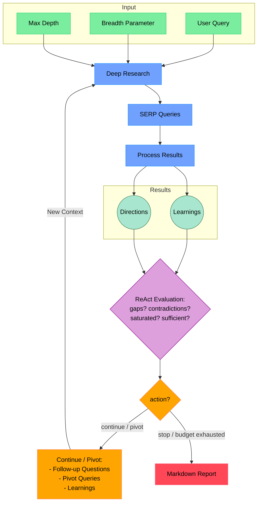

# Open Deep Research

An AI-powered research assistant that performs iterative, deep research on any topic by combining search engines, web scraping, and large language models.

The goal of this repo is to provide the simplest implementation of a deep research agent - e.g. an agent that can refine its research direction over time and deep dive into a topic. Goal is to keep the repo size at <500 LoC so it is easy to understand and build on top of.

If you like this project, please consider starring it and giving me a follow on [X/Twitter](https://x.com/dzhng). This project is sponsored by [Aomni](https://aomni.com).

## How It Works



## Features

- **ReAct Reasoning Loop**: After each search level, the LLM evaluates accumulated knowledge — identifies gaps, contradictions, saturation — and decides whether to continue, pivot to new queries, or stop early
- **Adaptive Depth**: Research stops dynamically based on coverage, budget (max queries, max time), or LLM decision, rather than a fixed depth counter
- **Multi-Model Architecture**: Route cheap extraction/summarization tasks to a fast model while using a powerful model for reasoning and report synthesis
- **Iterative Research**: Performs deep research by iteratively generating search queries, processing results, and diving deeper based on findings
- **Intelligent Query Generation**: Uses LLMs to generate targeted search queries based on research goals and previous findings
- **Depth & Breadth Control**: Configurable parameters to control how wide (breadth) and deep (max depth) the research goes
- **Smart Follow-up**: Generates follow-up questions to better understand research needs
- **Comprehensive Reports**: Produces detailed markdown reports with findings and sources
- **Concurrent Processing**: Handles multiple searches and result processing in parallel for efficiency

## Requirements

- Node.js environment
- A search provider (choose one):
  - **SearXNG** (free, self-hosted) - recommended for getting started
  - **Tavily API** (paid, higher quality results)
- An LLM provider (choose one):
  - OpenAI API key
  - Any OpenAI-compatible endpoint (OpenRouter, Ollama, vLLM, etc.)
  - Fireworks API key (for DeepSeek R1)

## Setup

### Node.js

1. Clone the repository
2. Install dependencies:

```bash
npm install
```

3. Set up environment variables in a `.env.local` file:

```bash
TAVILY_API_KEY="your_tavily_api_key"

OPENAI_KEY="your_openai_key"
```

To use local LLM, comment out `OPENAI_KEY` and instead uncomment `OPENAI_ENDPOINT` and `OPENAI_MODEL`:

- Set `OPENAI_ENDPOINT` to the address of your local server (eg."http://localhost:1234/v1")
- Set `OPENAI_MODEL` to the name of the model loaded in your local server.

### Docker

1. Clone the repository
2. Rename `.env.example` to `.env.local` and set your API keys

3. Run `docker build -f Dockerfile`

4. Run the Docker image (includes SearXNG):

```bash
docker compose up -d
```

5. Execute `npm run docker` in the docker service:

```bash
docker exec -it deep-research npm run docker
```

### SearXNG (free search provider)

SearXNG is a free, self-hosted metasearch engine that aggregates results from multiple search engines. It is the default search provider when no Tavily API key is configured.

**Option A: Docker (recommended)**

The `docker-compose.yml` already includes a SearXNG service. Just run:

```bash
docker compose up -d
```

SearXNG will be available at `http://localhost:8080`.

**Option B: Standalone Docker**

```bash
docker run -d -p 8080:8080 \
  -v ./searxng/settings.yml:/etc/searxng/settings.yml:ro \
  --name searxng \
  searxng/searxng:latest
```

**Option C: Without Docker**

See the [SearXNG documentation](https://docs.searxng.org/admin/installation.html) for native installation.

**Configuration:**

The included `searxng/settings.yml` enables JSON output format which is required for the integration. If you use a custom SearXNG instance, set the URL:

```bash
SEARXNG_URL="http://your-searxng-host:8080"
```

**Auto-detection:** When no `TAVILY_API_KEY` is set, the system automatically uses SearXNG at `http://localhost:8080`.

## Usage

Run the research assistant:

```bash
npm start
```

You'll be prompted to:

1. Enter your research query
2. Specify research breadth (recommended: 3-10, default: 4)
3. Specify research depth (recommended: 1-5, default: 2)
4. Answer follow-up questions to refine the research direction

The system will then:

1. Generate and execute search queries
2. Process and analyze search results
3. Recursively explore deeper based on findings
4. Generate a comprehensive markdown report

The final report will be saved as `report.md` or `answer.md` in your working directory, depending on which modes you selected.

### Concurrency

You can increase the concurrency limit by setting the `TAVILY_CONCURRENCY` environment variable so it runs faster.

If you are on a free Tavily plan, you may sometimes run into rate limit errors, you can reduce the limit to 1 (but it will run a lot slower).

### DeepSeek R1

Deep research performs great on R1! We use [Fireworks](http://fireworks.ai) as the main provider for the R1 model. To use R1, simply set a Fireworks API key:

```bash
FIREWORKS_KEY="api_key"
```

The system will automatically switch over to use R1 instead of `o3-mini` when the key is detected.

### Custom endpoints and models

There are 2 other optional env vars that lets you tweak the endpoint (for other OpenAI compatible APIs like OpenRouter or Gemini) as well as the model string.

```bash
OPENAI_ENDPOINT="custom_endpoint"
CUSTOM_MODEL="custom_model"
```

### Multi-model (cost optimization)

You can route cheap extraction/summarization tasks to a smaller, faster model while keeping a powerful model for reasoning, planning, and report synthesis:

```bash
OPENAI_KEY="your_key"
OPENAI_ENDPOINT="https://openrouter.ai/api/v1"
CUSTOM_MODEL="deepseek/deepseek-r1"       # powerful model for reasoning
FAST_MODEL="openai/gpt-4.1-mini"          # cheap model for extraction
```

When `FAST_MODEL` is not set, all tasks use the primary model (default behavior).

### Research budget

Control how much compute the research uses:

- **Max queries**: Total search queries across all depth levels. Set `maxQueries` in the web UI settings or leave at 0 for auto-compute from breadth/depth.
- **Max time**: Wall-clock time limit in milliseconds. Set `maxTimeMs` in settings or leave at 0 for unlimited.

## How It Works

1. **Initial Setup**

   - Takes user query and research parameters (breadth & max depth)
   - Generates follow-up questions to understand research needs better

2. **Iterative Research Loop** (per level)

   - Generates SERP queries based on current research direction and accumulated learnings
   - Processes search results in parallel to extract key learnings and follow-up questions
   - Merges new findings into accumulated state

3. **ReAct Evaluation** (between levels)

   - The LLM evaluates all accumulated knowledge against the original query
   - Identifies knowledge gaps, contradictions between sources, and saturation
   - Decides the next action: **continue** (follow-up questions), **pivot** (new search direction), or **stop** (sufficient coverage)

4. **Adaptive Stopping**

   - Research stops when: the LLM says "stop", the budget is exhausted (max queries or time), or max depth is reached
   - The `depth` parameter acts as a ceiling, not a fixed count

5. **Report Generation**
   - Compiles all findings into a comprehensive markdown report
   - Includes all sources and references
   - Organizes information in a clear, readable format
  
## Community implementations

**Python**: https://github.com/Finance-LLMs/deep-research-python

## License

MIT License - feel free to use and modify as needed.
